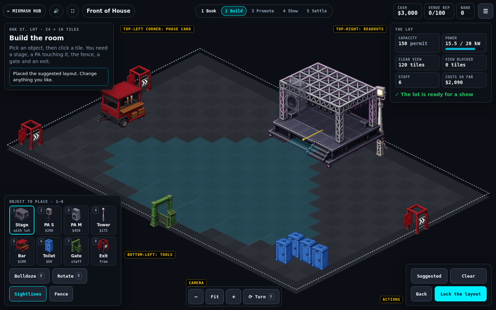
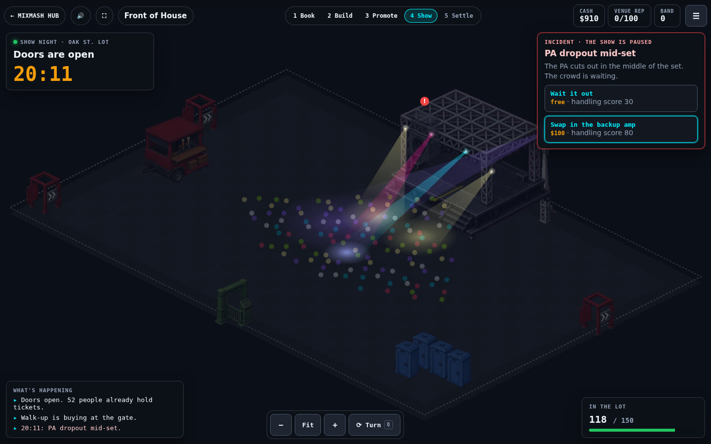
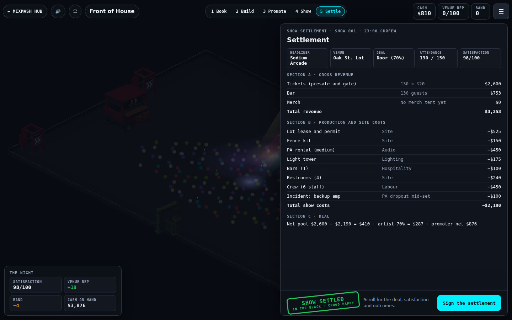
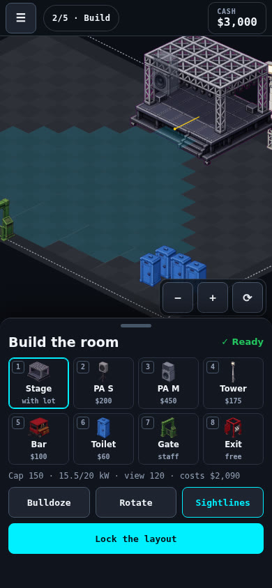

# Front of House HUD layout (spec)

- Date: 2026-10-01
- Status: **Accepted by Dave on 2026-10-01** ([CT-DEC-12](DECISIONS.md#ct-dec-12-hud-layout)), with every recommendation in section 9. The minimap is deferred to step 7 of the build order and is on the [roadmap](../ROADMAP.md#hud-layout-ct-dec-12). On 2026-10-02 Dave added that no panel scrolls either (section 9). Steps 1 to 5 are built (the camera, the full-window board that never scrolls, the Build and Show corner HUD, the sheets and windows, and the phone tabs); steps 6 and 7 are not.
- Owner: Dave Robertson
- Asked for: "a redesign of the UI before we get too far... more HUD like, with the map expanded to take up a much larger percentage of the screen real estate."

The map is the game. Today it is a column beside a long panel. This spec makes the board fill the window in every phase and floats the controls over it as a heads-up display (HUD). The rules, the engine, saves and the art do not change.

## 1. Where the layout is today

Measured on 2026-10-01 in Chromium on the live build (`1bf48e1`), with the suggested layout on the Oak St. Lot.

| Window | Board canvas | Lot (the playable diamond) as a share of the window | Tile width | Page height in Build |
| --- | --- | --- | --- | --- |
| 1024 × 768 | 558 × 325 | 8.6% | 26 px | 1,594 px |
| 1280 × 800 | 814 × 488 | 14.9% | 39 px | 1,594 px |
| 1440 × 900 | 974 × 588 | 17.0% | 47 px | 1,594 px |
| 1920 × 1080 | 1,454 × 888 | 24.3% | 71 px | 1,594 px |
| 390 × 844 (phone) | 356 × 200 | 7.8% | 16 px | 2,460 px |

What causes it:

- The board is sized from its column's width only (`resize()` in `board.js`), so it can never use the window's height.
- The header (brand, stepper, meters) and the shared MixMash nav take 156 px above the board.
- The side panel is 320 to 560 px wide and 550 to 1,440 px tall, so every phase except Show scrolls the page.
- The settlement widens the panel, so the board shrinks to 31% of the window at 1280 × 800 and 16% at 1024 × 768.

## 2. Goals and non-goals

**Goals**

1. The board fills the window in every phase. The canvas is the page.
2. At the default zoom the lot is fit to the window. It covers at least 30% of the window at every desktop size, and at least 35% at 1280 × 800 and 1440 × 900: 1.4 to 3.5 times today.
3. In Build and Show, the HUD covers no more than 2% of the lot at the default zoom.
4. No page scrolling at 1024 × 700 and up. A panel that needs more room scrolls inside itself.
5. Every control stays reachable by keyboard, and every rule from `ART_DIRECTION.md` section 5 holds: 44 px targets, visible focus, words as well as colour, no inline handlers.

**Non-goals**

- No rule, number or save change. Selectors the smoke rail uses (`data-act`, `data-deal`, the element ids) and the `window.__frontOfHouse` hooks stay.
- No new art. The stand-in sprites stay until the render contract (`FUTURE.md`).
- No touch gestures in v1. Pinch and drag wait for touch support ([CT-DEC-04](DECISIONS.md#ct-dec-04-platform)). Buttons for zoom and turn work on every device.
- No minimap in the first pass. It is step 7 of the build order (section 10), and it is on the roadmap so it isn't lost.

## 3. The idea: the HUD lives in the lot's empty corners

An isometric lot is a diamond. A diamond fills exactly half of the rectangle around it, and the other half is four corner triangles. When the lot is fit to the window, those triangles are about a third of the screen, and almost nothing of the game is drawn in them. The HUD goes there.

| Region | What it holds |
| --- | --- |
| Top strip | The shared MixMash nav (hub and mute), the name, the phase stepper, the meters (cash, venue rep, band) and a menu button |
| Top-left corner | The phase card: where you are, what to do, and the message line (`#msg`) |
| Top-right corner | Status: the lot's readouts in Build, the incident card in Show |
| Bottom-left corner | Tools in Build, the event feed in Show |
| Bottom-right corner | The phase's actions (Lock the layout, Open the doors, Sign the settlement) or the live crowd count |
| Top strip (since step 3) | Camera: zoom out, fit, zoom in, turn the view. Planned for the space under the lot's front tip; that space would cost the fit about 4 points of lot share at 1280 × 800 (an estimate), so the buttons moved to the strip |

Phases where the map is the work (Build, Show) keep the whole lot clear. Phases where the work is a form or a document (Book, Promote, Settle) open a **sheet** on the right, dim the map, and re-fit the lot into the space that is left.

### Mockups

Composites made for this spec: the board underneath is a real capture of the full-window board on seed 170 (a PA dropout), and every number is from that same run. The panels are layout direction, not final styling.

**Build, 1440 × 900.** The lot covers about 36% of the window (17% today); the HUD covers 0.2% of the lot. Yellow dashed labels name the regions.

**Show night, 1440 × 900.** The incident card sits in the top-right corner, next to the stage and its marker. The HUD covers none of the lot.

**Settle, 1440 × 900.** The settlement is a sheet over the dimmed map, with the stamp and Sign the settlement in its footer. The night's outcomes sit bottom-left.

**Build on a phone, 390 × 844.** The board takes the top half, zoomed in. Phase controls sit in a bottom sheet.

## 4. Phase by phase

| Phase | Map | Top-left | Top-right | Bottom-left | Bottom-right | Sheet |
| --- | --- | --- | --- | --- | --- | --- |
| Book | The chosen room, dimmed | | | | | Rooms, nights and the two offer cards side by side; the deals are explained under their buttons on a career's first show and in the Deals window (ⓘ) after that. The mode buttons moved to the menu's New game section (step 4) |
| Build | Full, sightlines on | Phase card and message | Readouts (capacity, power with a bar, clear view, blocked, staff, costs) and the readiness line | Tools 1 to 8 with sprite thumbnails and costs; Bulldoze, Rotate, Fence, Sightlines | Suggested, Clear, Back, **Lock the layout** | |
| Promote | Full, static | | | | | Two columns: price and ads, then the forecast and the presale chart; **Open the doors** |
| Show | Full, night lighting | Clock and "Doors are open" | The incident card with its responses (first response focused, as now) | Event feed, last 3 to 4 lines | Crowd in the lot, Skip to the problem | |
| Settle | Dimmed | | | | | A short summary. The settlement opens in its own window in three columns, with the stamp, the tip and **Sign the settlement** in its footer (decision 9) |
| Done | Dimmed | | | | | Career progress, the goal checklist, one line on the last show, Start over, **Book the next show**; the last settlement and the show history open as windows |

Notes:

- **Tools get number keys 1 to 8**, in palette order. They are new; every other key stays (arrows, Enter, R, B, Q, Delete).
- **Undo and Redo** (2026-10-03) are tiles after Rotate, with Ctrl+Z or ⌘Z and Ctrl+Shift+Z, Ctrl+Y or ⌘⇧Z. The tool grid went from five columns to six so they fit without a new row: a new row in the actions corner covered 2.55 to 3.04% of the lot at 1024 × 700, and the grid measured 1.40% against the 2% limit.
- **Placed objects** moved into a Details window opened from the Build readouts (step 3), so keyboard users can still remove an object by name without a scrolling panel.
- **The view turn** moves into the camera group. Its status line ("View quarter 1 of 4") becomes a short toast under the top strip, still `aria-live`.

## 5. The camera (`board.js`)

Today `resize()` fits the lot to the canvas width and grows the canvas downward. The HUD needs a camera.

- **Safe rectangle.** The window minus the top strip, minus an open sheet. Fit and centring use this rectangle, so opening a sheet slides the lot left instead of hiding it.
- **Fit.** The tile width is the largest that fits the lot's diamond, plus headroom for the tallest prop, inside the safe rectangle, by width and by height. That is about 61 px at 1280 × 800 and 69 px at 1440 × 900, against 39 and 47 today. Wide 16:9 windows are limited by height: about 84 px and 34% of a 1920 × 1080 window.
- **Zoom.** Fit, then ×1.5, ×2 and ×3. Buttons in the camera group; `=` and `-` and `0` (fit) on the keyboard; the mouse wheel zooms about the pointer. Since step 2 the page never scrolls, so the plain wheel zooms; Ctrl or Cmd with the wheel, and a trackpad pinch, do the same.
- **Pan.** Drag with the middle button anywhere, or a plain drag outside Build. Space can't be the pan key, because Space places an object in Build. Shift with the arrow keys pans. In Build, the arrow keys still move the build cursor, and the camera follows when the cursor nears an edge. The lot can't be panned out of the window.
- **Turning the view** keeps the zoom and re-centres on what was at the centre.
- **Contained change.** Every screen position goes through `iso()` and `tileAt()`, so the camera is three fields on `view` (zoom, pan x, pan y). Hit-testing, placement order, markers, beams and the ghost all use `iso()` and follow it.
- **Rooms.** Split Acre (40 × 24) fits at 44 px a tile on 1440 × 900. Zoom matters most there.

### Continuous orbit direction (2026-10-02)

Dave prefers a full 360° view and finds the current fixed angle awkward. The current implementation still has four quarter turns. The direction below is a proposal for the renderer change; the prop treatment has not yet been selected.

- Use dimensional props for an orbit that can stop at any yaw. The existing sprites are paintings of one side; four additional views would still impose discrete angles. Keep their silhouettes, colours and production detail as visual references, and compare a modelled stage, bar and restroom bank before replacing the full set.
- Keep the simulation's tile grid and object rotation independent of the camera. Camera movement must not alter placements, sightlines, money, show timing or saved gameplay state.
- Start with an orthographic camera, continuous yaw and a bounded tilt control. Choose the default tilt through side-by-side review; Fit must account for the current angle, tall props and the HUD's clear area.
- Give orbit an explicit drag tool and accessible angle controls. It must not accidentally place or bulldoze objects. Preserve pan, zoom, Fit and object rotation as separate operations, with touch and keyboard equivalents.
- Use actual surface depth for props, crowd and picking. Hidden equipment should have a deliberate selection/locate treatment, not a general transparent repaint through unrelated objects.
- Acceptance: place, select and remove the same object at arbitrary angles; retain tile positions through a full revolution, zoom, pan, resize and phase change; keep incident markers and lights attached; verify desktop, split view and phone layouts; measure frame time against section 6. Reduced motion disables camera easing, not camera access.

## 6. Performance

A full-window canvas draws more pixels: 1440 × 900 at a device pixel ratio of 2 is 5.2 megapixels, against 2.3 today, and 1920 × 1080 is 8.3. Show night redraws every frame.

- Cache the floor, the grid, the parking stalls, the fence line and the sightline overlay in an offscreen canvas. Redraw that cache only when the room, the layout, the view, the zoom or the pan changes.
- Props, the crowd, lights, rain, markers, the cursor and the ghost still draw each frame. Crowd dots are interleaved with the props they stand between, so props can't join the cached floor.
- Keep the pixel-ratio cap at 2. Drop to 1.5 when the canvas would pass 6 megapixels.
- Budget: [CT-DEC-17](DECISIONS.md#ct-dec-17-performance-acceptance), accepted 2026-10-04, uses stable CI regression scenes plus declared 60fps desktop / 30fps low-power device targets. It supersedes the original absolute headless p95-under-16ms design gate. Specify devices, scenes, sampling and thresholds from baselines before claiming acceptance; headless results are regression evidence, not physical-device proof. Existing checks stay until a tested replacement lands.

### Review refinement (2026-10-02)

Dave accepted the combined review of the 25-page HUD mockups and asked to execute the next pass. Steps 1 to 5 already exist; this pass refines the current Build and Show controls rather than replacing their layout.

- Show distinguishes its pre-incident crowd outlook from a live mood reading, and explicitly says when a doors choice or incident has paused play. Incident responses explain cover, sound, entry flow or ending the set instead of exposing a raw handling score. Costs and engine-derived sales/flow percentages remain visible.
- Locate PA, gate or stage centres the affected object at 2× zoom; it never resolves the incident. For a house PA, the stage is the location proxy. Rain has no equipment location. On phones Locate is in the Night tab.
- Build and Show phone sheets have 44 px expand/reduce and hide/show buttons. A swipe on those controls is optional. Hidden controls are inert; a new incident restores the peek sheet and selects Problem. Desktop resizing restores all controls. Phone tool tiles omit keyboard shortcut badges.
- Controls default to a light palette, with a persistent Dark controls toggle in the menu. The map retains its night palette. Shared navigation stays visible while idle.
- The revenue forecast already uses one engine-derived range, and Skip already hides at an incident; those review recommendations needed no new rule or flow.

Step 6 remains the next implementation phase: establish the 1920 × 1080 frame-time baseline, cache the static floor with explicit invalidation, and compare the same seeds and camera states before and after. Headless measurements are a proxy; laptop and phone playtests still determine real usability. The minimap remains deferred, and public promotion still requires Dave's playtest sign-off.

## 7. Accessibility and HUD rules

- **The HUD is HTML over the canvas,** never drawn on it. Text stays selectable, translatable and readable by screen readers.
- **Clicks reach the board between panels.** The HUD layer has `pointer-events: none`; each panel turns them back on.
- **One controls landmark.** The phase panels stay inside `#panel` ("Controls") in reading order (phase card, tools or status, actions) and are placed with CSS. The skip link, `focusHeading()` and the smoke selectors keep working.
- **Backplates.** Every panel sits on a near-opaque backplate (about 86% of the desk colour), so small text keeps 4.5:1 over any part of the board. The contrast check in the smoke rail covers the HUD's text.
- **Live regions stay as they are:** `#msg`, the feed and the board status are polite. The meters are not live; their changes are announced through the message line when they matter.
- **Keys** are listed in a help panel from the menu (`?`), which replaces the board's help paragraph. Since 2026-10-03 the list is one row per binding in `controls.mjs`, the table both key handlers read, and a test fails if the two differ.
- **Reduced motion:** sheets appear without sliding, and camera moves jump instead of easing.

## 8. Narrow screens and phones (under 680 px)

[CT-DEC-04](DECISIONS.md#ct-dec-04-platform) puts the desktop first and lets phones show the board in a reduced view, with every control reachable.

- The top strip shrinks to the menu, the phase ("2/5 · Build") and cash. The MixMash nav and the other meters move into the menu. **As built (step 5):** two rows, the nav's icons, the current phase and the menu, then the three meters; the board still gets 46% of a 390 × 844 screen, so nothing moved into the menu.
- The board takes the top half of the window, zoomed in on the stage by default, with zoom and turn buttons. Fit shows the whole lot.
- Phase controls sit in a bottom sheet at two heights: a peek height (the mockup) and full height for Book, Promote and Settle. **As built (step 5):** Build and Show use the peek sheet with the phase card as its header and tabs for the rest (Lot, Tools, Actions; Problem, Night); Book, Promote and Done take the height under the strip, with a tab per act on Book and Price and ads, Forecast and Presales on Promote; the settlement window has Revenue, Costs, Payout and Crowd tabs. Nothing scrolls, apart from the show history window (decision 11).
- No horizontal scrolling, as the smoke rail checks now.

## 9. Decisions (settled 2026-10-01)

Dave accepted every recommendation on 2026-10-01, and asked for the minimap to stay on the canonical roadmap.

| # | Question | Decision | Why |
| --- | --- | --- | --- |
| 1 | Corner HUD, or one docked drawer down the right side? | Corner HUD | The drawer is simpler, but it always covers the lot's right corner; the corners cover 0.2% of it |
| 2 | Which side do sheets open on? | Right | The stepper and meters read left to right; the lot slides left and stays visible |
| 3 | Mouse wheel zooms? | Yes | The page no longer scrolls, so the wheel is free |
| 4 | The MixMash nav pills in the top strip | Keep hub and mute; move fullscreen and the GitHub link into the menu | They are the site's shared nav (`src/kit/nav.js`); this changes how Front of House styles them, not the kit |
| 5 | Phones: bottom sheet, or ask for landscape? | Bottom sheet | It keeps everything reachable in portrait, as CT-DEC-04 asks |
| 6 | A minimap? | Deferred to step 7, and on the roadmap | The Lot and Fathom Hall fit at a good tile size; Split Acre needs it once players zoom in |
| 7 | Translucent backplates over the board | Accept, as an addition to the production-desk look | Dark panels, 1 px borders and mono numbers stay; only the panels float |

### Panels never scroll (settled 2026-10-02)

After step 2, Dave asked that the panels not scroll either, "especially not when its things that could easily be collapsed or moved to its own window". He agreed to all five recommendations on 2026-10-02 ("I agree with your assessment"):

| # | Question | Decision |
| --- | --- | --- |
| 8 | Does any panel scroll? | No panel scrolls at 1024 × 700 and up. The smoke rail fails when one does |
| 9 | The settlement | It opens in its own wide window: the payoff gets the screen |
| 10 | Deal explanations and introductions | Shown on the first show only, then behind an info button |
| 11 | Show history, which grows every show | Its own window, and the only one allowed to scroll |
| 12 | Phones | Tabs in the bottom sheet, so the rule holds there too |
| 13 | When | Built inside steps 3 and 4, not as a separate pass |

## 10. Build order

Each step is its own pull request with its smoke updates and a service worker bump. The same steps are in [`ROADMAP.md`](../ROADMAP.md#hud-layout-ct-dec-12).

1. **Camera.** Safe rectangle, fit, zoom and pan in `board.js`, behind today's layout. Tests: `tileAt(iso(x, y))` round-trips at every zoom and view turn; clicks still hit the right prop. **Done 2026-10-01.** The safe rectangle is the whole canvas until step 2 gives the board the window.
2. **Full-window board and top strip.** The canvas fills the window; the header becomes the strip; the save bar, help and credit move into the menu. **Done 2026-10-01.** The page never scrolls at any size, phones included: the canvas covers the window, and the panel and the menu scroll inside themselves. Until steps 3 and 4 split it up, the phase panel stays whole: docked on the right, with the lot fit into the space left of it and below the strip, and a bottom sheet on phones. The camera group sits in the lot's empty bottom-left corner. Full screen and the source link moved from the MixMash nav into the menu (`?`), with the keys and save and load. The lot's share of the window in Build is 15% at 1024 × 700, 18% at 1280 × 800, 19% at 1440 × 900 and 26% at 1920 × 1080; the 30% and 35% targets need step 3, when the panel leaves the right side.
3. **Build and Show HUD.** Corner panels, the tool keys, the camera group, the incident card. **Done 2026-10-02.** Build: the phase card top left (what the chosen tool is, its size, cost and power, and the message line), the readouts top right (capacity, power with a bar, clear view, blocked view, staff, costs, the readiness line, the fence kit, sightlines and a Details button), ten tool tiles bottom left (the eight objects with their sprites and keys 1 to 8, then Bulldoze and Rotate), and the actions bottom right. Details opens a window with the full readiness list and every placed object by type, each with a remove button. Show: the clock top left, the incident card top right with compact responses, the last four feed lines bottom left, and the crowd count with Skip bottom right. The camera buttons moved into the top strip (section 3), the board's status line is a toast under the strip that fades after five seconds, and the fit keeps 3 tile heights above the lot and half of one below. Measured at the fit: the lot covers 34.9% of the window at 1024 × 700, 31.8% at 1024 × 768, 36.3% at 1280 × 800, 37.8% at 1440 × 900 and 34.8% at 1920 × 1080; the plates cover at most 1.31% of the lot (Build at 1024 × 700 with a two-line message), and no plate scrolls. Phones still stack the plates in a bottom sheet that scrolls until step 5. Book, Promote, Settle and Done keep the scrolling sheet until step 4.
4. **Sheets.** Book, Promote, Settle and Done. **Done 2026-10-02.** Book and Promote use a wide sheet on the right (two offer cards, or two columns of controls), Done a narrow one, and the map dims behind Book, Settle and Done. The settlement opens in its own window on curfew: the sheet's sections in three columns (revenue and the deal; costs; payouts, satisfaction and what carries over), with the stamp, the tip and the signature in the footer; Done reopens it read-only, and the show history opens in the only window allowed to scroll. Deal explanations show under the buttons on the first show of a career or the wet lot only; Sandbox and later shows get them from the Deals window. Career, Sandbox and Wet lot moved into the menu's New game section, and on a game already under way the first press asks before it erases anything. Measured: nothing scrolls in any phase at 1024 × 700, 1024 × 768, 1280 × 800, 1440 × 900 or 1920 × 1080, nor in any room's Book sheet or in Promote with seats or a sponsor at 1024 × 700; the settlement's worst case there (nine cost lines) needs 490 of the 510 px its window has. On phones the windows stack their columns and may scroll until step 5.
5. **Phone.** The bottom sheet and the compact strip. **Done 2026-10-02.** Tabs keep every sheet and window from scrolling on a phone (decision 12): the groups marked `data-tab` share one space, a tab at a time, with arrow keys between the tabs, and a wider window drops the tabs and shows every group again. The incident brings its tab forward. Measured at 390 × 844: every tab of every phase and of the settlement window fits (the rain incident's three responses fill the Problem tab exactly), and the board takes 46% of the height in Build and Show. The camera buttons float above the peek sheet and hide behind the full-height sheets.
6. **Performance.** The floor cache, the pixel-ratio rule, and the frame-time check.
7. **Minimap (deferred).** Starts once step 1 has shipped and Split Acre is being played zoomed in. See below.

### Step 7: the minimap

- **What it shows:** the whole room at a small scale (floor, props as blocks, the crowd as a heat tint on show night) and a rectangle for what the camera shows now.
- **What it does:** a click or drag moves the camera there. It turns with the view. Fit, the zoom buttons and the pan keys stay the keyboard path, so the minimap is a shortcut, not the only way.
- **Where:** a small corner panel, about 180 × 110 px, shown only when the camera is zoomed in past fit; at fit, the whole room is already on screen. Hidden on phones, where Fit does the same job.
- **Done when:** it shows the whole room and the view rectangle at every zoom and view turn in every room; a click centres the camera on that spot; it is hidden at fit; show night still meets the frame budget in section 6.

## 11. Done when

The smoke rail measures each of these and fails when one slips.

- The canvas covers the window in every phase at 1024 × 768, 1280 × 800, 1440 × 900 and 1920 × 1080.
- At the default zoom the lot covers at least 30% of the window at every desktop size, and at least 35% at 1280 × 800 and 1440 × 900 (today 8.6% to 24.3%).
- In Build and Show the HUD covers no more than 2% of the lot at the default zoom.
- The document never scrolls at 1024 × 700 and up, and no panel scrolls there either, apart from the show history window (decision 8).
- The settlement opens in its own window (decision 9).
- At 390 × 844 there is no horizontal scroll, every phase control is reachable, the board takes at least 45% of the window's height in Build and Show, and no tab of the sheet or the settlement window scrolls.
- Every existing smoke check passes, and the contrast check covers the HUD.
- Show night meets the frame budget in section 6.

The minimap (step 7) has its own done line, above.

## Club ticketing pilot

Club Promote and Menu open a contained Plan/Forecast/Receipt window. Direct costs nothing; Platform adds20 percentage points to the presale share up to90% and retains4% of presale gross. Selecting a plan does not charge cash. Doors lock the choice. Forecast uses public act draw bounds, booked draw multiplier, ads, reputation and capacity; the actual receipt appears only after the show. Settlement displays collection separately from production deductions. Short windows share Equipment's explicit content pager; neither dialog uses ordinary form scrolling.

## Held nights pilot

Multi-night Amphitheater offers show their per-unplayed-night cancellation fee before the deal is chosen. Menu opens Terms/Continue/Cancel/Receipt. Settlement uses Choose next night while contracted nights remain; each choice shows its exact cash outcome and signs the current show once. A disabled continuation explains insufficient cash, while cancellation states any resulting debt. The signed cancellation receipt can be reopened from Menu or the signed sheet. All four pages share the contained compact-window pager.

## Seats and lawn pilot

Amphitheater Book discloses separate sales. Promote retains the two price sliders and opens Seats/Lawn/Rules from Seats and lawn. Before doors, each page shows public draw-range tickets, presales and gross; later incidents remain uncertain. After the night, the pages show actual count, frozen price, gross and zone value score alongside shared show quality. The settlement ticket line and Menu reopen these receipts. The overall forecast and presale chart use the same independent zone calculation. Short windows use contained paging.

### Festival bill and stage accounts

Festival Book discloses one site ticket and both stage budgets. Stage bill opens a six-page contained window: Bill, Main, Side, Site, Cash and Rules. Bill selects a prior-tier act currently eligible for a door deal; choosing costs nothing and persists until the main booking freezes both acts. Guarantee-only/soured acts are not forced into door contracts. If none qualify, Book explains the restriction and venue selection remains available.

Promote and Menu reopen Stage accounts. Main/Side use public draw bounds before doors and source-derived actual receipts after response. Site combines the single ticket gross, shared income, all production/site costs and both artist payments. Cash explicitly reconciles opening outflow, response already paid, signing income and final balance; a signed reopen uses recorded historical cash. Rules disclose the aggregate audience allocation and shared site-quality model. Compact windows page content; every field remains reachable without ordinary form scrolling.

Settlement includes both production budgets, total artist pay and a link to detailed accounts. A side-stage ticket is never added as extra revenue. The main door basis uses its own stage; side pay is withheld once at signing. The Promote ticket estimate now uses the same independent seating or Festival gross as its detail window, and the Festival presale chart uses the same published forecast. Version50 refreshes the player controls. Physical-device and final scene acceptance remain separate.

## 2026-10-04 navigation implementation

Step7 now has a locally verified Split Acre desktop implementation. The overview follows arbitrary3D yaw and clips the actual visible ground at low pitch; it includes the fixed side-stage annex in3D. Classic uses its yard and discrete view turns. Pointer/keyboard pan preserves zoom and saves, and measured HUD gaps keep primary controls clear. Fit, phones and compact windows without room hide the map. Twelve frozen-source native full-client overview windows are recorded in PERFORMANCE.md. Delivery and physical/human acceptance remain open; the existing full-HUD performance issue is not closed by geometry or browser checks.

### Festival sponsor and headline conditions

Version51 adds the fixed ticket price to every Festival sponsor choice. Promote labels the disabled slider “Sponsor ticket price”; ad controls remain active. The accepted Bill repeats the condition. Guarantee and earned door deals retain adjustable ticket prices. Bill explains the +20 relationship required for earlier-tier headliners. If the selected side act also appears in the main offers, its booking buttons are disabled with an instruction to choose another side act. A Done career with no willing side act offers “Choose another venue” and carries cash/history forward without a new charge.

### Amphitheater sound and slope

New Amphitheater Book offers disclose the included shell rig. Build's readiness line identifies shell or portable sound and its audience capacity; Details links to the Room tab in Seats and lawn. Room reports the current system, sound capacity, room capacity and clear/blocked viewing counts. It explains portable replacement, the light requirement and rising-lawn occlusion. Promote, Menu and signed settlement reopen the same information. A profile-only saved room can still open its Room page before booking zone sales. The overlay cache follows the actual profile, matching the engine when only a save's profile changes.

Version52 precaches the room-profile module. These controls and the clear-view overlay expose the new rule; the existing flat fallback artwork is not presented as a completed dimensional Amphitheater scene.

### Festival room report

New Festival bookings disclose the included3,000-person Main system. Build Details → Sound and views opens the existing Room report. Stage accounts adds the same Room page for Promote, Show and settlement; the game menu offers Sound and views, including the next unbooked show. The report lists current house/portable system, sound capacity, site capacity, clear and blocked tiles; it explains flat ground, raised main stage, shared-site quality and the half-permit base rig. It uses existing contained tabs and compact paging. The `render_game_to_text.room` probe reports the same engine counts and overlay counts; it never substitutes drawn crowds for attendance.

### Delay placement and receipt

The Festival Build palette offers Delay with key D; it quotes675 per tower including the operator. Placement, Select, rotation, remove, undo/redo and keyboard cursor follow existing controls. The Room report adds a Delay page with tower count, extra covered tiles and the total show deployment charge, and explicitly discloses inactive towers when a portable PA or missing profile disables benefit. Stage accounts lists delay deployment within main production; the ordinary Costs page lists it once under Production, beside a separate Site button. Each page retains the full show-cost total; category rows together reconcile to it. The text room probe includes `delays`, `delayTiles`, `delayCost` and `delayActive` when towers exist. Geometry is provisional code art and does not certify a final venue scene.

Outdoor curfew uses the existing incident choices. SET ENDED in the settlement header opens Set time details; the window's Back to settlement restores the signed or unsigned receipt. Timing details use normal compact pagination, avoiding extra rows in production/crowd tables.
