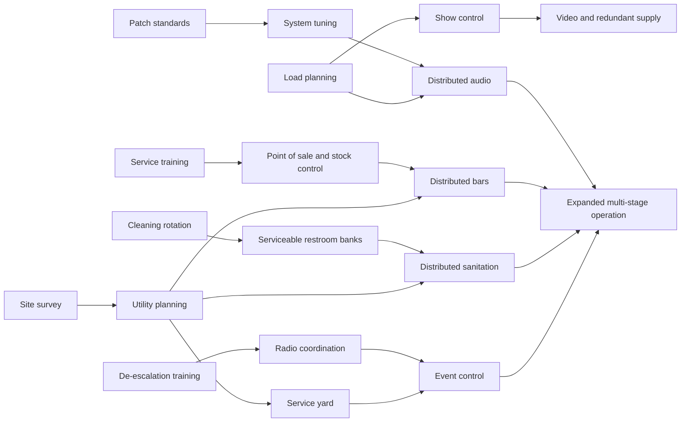

# Front of House: Research and Upgrade Dynamics

**Status:** Proposed design, 2026-10-03. Documentation only; no research system is implemented. Recorded in [CT-DEC-13](DECISIONS.md#ct-dec-13-research-and-upgrade-progression). The current [rules](RULES.md), [save format](SAVE_FORMAT.md) and career unlocks remain authoritative for the playable game.

## 1. The player fantasy

Build an organization that gets better at putting on shows. After a night, the player sees what constrained the experience, invests in a capability, then designs a future show that makes that investment worthwhile. A growing operation can deliver more ambitious productions, serve larger audiences, handle difficult arrivals and earn access to better rooms.

The Age of Empires reference is a design shorthand: visible prerequisites, distinct branches, tier milestones and a limited budget create competing development paths. In Front of House, research means training, operating procedures, supplier development and infrastructure planning. Equipment is rented or purchased separately. A researched line array is permission to specify and operate that package; it does not put a free rig in every venue.

**Core loop:** settle a show → identify a constraint → choose a development project → complete its training or trials over subsequent nights → deploy the unlocked capability → compare the next show's results.

## 2. Four tiers, many viable paths

Keep the accepted [career ladder](DECISIONS.md#ct-dec-09-career-tier-ladder). These are capability bands within the existing tiers, not extra ages or a replacement set of venue goals.

| Tier | Development emphasis | Strategic tension |
| --- | --- | --- |
| The Lot | Reliable basic production, bar service, sanitation routines and admission flow | Improve the next night or keep cash toward the Club |
| The Club | House systems, trained supervisors, ticketing, permanent services and supplier relationships | Specialize the room or keep it flexible for different acts |
| The Amphitheater | Distributed sound, weather resilience, zoned services and coordinated teams | Higher quality and capacity bring recurring cost and longer setup |
| The Festival Grounds | Multiple stages, site distribution, vendor districts and event control | Expansion competes with reliability and audience movement across the site |

Reaching a tier reveals its projects; it does not grant every upgrade. A capability from an earlier tier can remain the best choice for a small show. Players may return to unlocked rooms and develop them. The current Lot, Club and Amphitheater goals remain unchanged until a separately tested progression revision is accepted.

Venue access and venue readiness are different. Career milestones unlock the next room. Research offers ways to equip it. Before booking or opening a particular configuration, the room must meet its operating requirements through its house facilities, ordinary rentals or researched options. Never require research that can only be earned inside a room to enter that room for the first time.

## 3. What an unlock actually grants

| Layer | Persists where | Examples | What still has to be paid or provided |
| --- | --- | --- | --- |
| Organizational knowledge | Career | Patch standards, admission procedures, service training | Qualified staff and any required equipment on each show |
| Supplier access | Career | Specialist PA packages, managed vendor contracts | Rental or contract fees, availability and operating costs |
| Installed infrastructure | One venue | Service yard, permanent bar, additional utility circuits | Installation, floor area, access rights and maintenance |
| Show configuration | One booking or night | Extra admission lane, backup amp, delay tower | Hire, crew, power, space and deployment time |

Research is permanent within a career. Closing a bar, switching venues or losing a supervisor does not erase knowledge; it can make its benefit inactive. Rehiring or redeploying restores eligibility. Starting a new career resets research. Sandbox exposes all projects and capabilities without development costs, while physical layout and operating constraints still apply. A scenario supplies explicit starting research and restrictions.

Renting stays viable throughout the career. Ownership, depreciation and asset accounting remain the separate [economy proposal](SAVE_FORMAT.md#proposed-next-save-and-economy-transition). This tree can first work with rental packages and procedures; it must not make ownership a hidden prerequisite.

## 4. Research economy and timing

Use **cash, department experience and a limited development slot**. Reputation, relationships and career tier are eligibility checks, not currencies that disappear when spent.

- **Cash:** project cost is paid when development starts. The panel shows the remaining balance against the next show's quoted obligations and an incident reserve. Current cash gates still apply; expected ticket revenue cannot fund research before settlement.
- **Department experience:** a cumulative, unspent record of relevant operating experience. Production, guest services, admissions/security and venue operations each have a track. A settled night earns bounded experience for departments that actually operated. A difficult or losing show can still teach something; attendance alone must not let large venues race through every branch.
- **Development slot:** begin with one organization-wide active project. Choosing bar training delays sound development. An advanced operations office may add parallel capacity later, with its own staffing cost; it must not be necessary to finish the career.
- **Duration:** count eligible settled nights, not real time, wall-clock waits or repeated clicks. A project identifies its required department and operating conditions before purchase. Completing the final night makes the capability available for the next booking; it never changes an already quoted or running show retroactively.
- **Pause and cancellation:** pause keeps progress and frees the slot. Cancel returns only the uncompleted portion of the project cost; completed work is not refunded. The preview states the exact refund before confirmation. Reloading, importing or revisiting settlement cannot award experience, progress or refunds twice.

A multi-night hold can advance research once per distinct settled night, but new benefits wait until the next booking so the held run's terms remain consistent. Paused projects do not progress. Cancelled or unplayed nights earn nothing. A project that needs a bar cannot advance through shows with no bar; the panel explains that before the player books.

The first research opportunity appears after the first settlement, with a short list based on the night's actual constraints. There is always a low-cost foundational route whose experience requirements are attainable with baseline equipment. No project requires its own reward to earn progress. Costs, experience thresholds, effect sizes and durations remain untuned; on implementation they belong in [data.mjs](../data.mjs), with names referenced in the rules and balance reports.

## 5. Branch catalogue

Every row is proposed. Within a row, the three named stages are a prerequisite chain; the leftmost stage is available at the tier named beside it. Later stages also require their own tier and deployment conditions. A cross-branch requirement is additional to the preceding stage, and uses capabilities defined below. Baseline facilities remain available without research.

| Branch | Entry project | Developed capability | Advanced capability | Costs and constraints that keep it interesting |
| --- | --- | --- | --- | --- |
| **Audio production** | **Patch standards** (Lot): better diagnosis and a more effective paid response to a PA dropout | **System tuning** (Club): commissioned coverage using the house rig or a suitable rental | **Distributed audio** (Amphitheater): delay coverage for distant audience zones; also requires Load planning | Technical labor, tuning time, rental cost, power and sightline footprint. More output is not automatically better coverage |
| **Lighting, video and power** | **Load planning** (Lot): clearer power allocation and access to an appropriately sized distribution package | **Show control** (Club): programmed lighting with a qualified operator | **Video and redundant supply** (Amphitheater): screen packages and selected backup circuits | Power, crew, rigging space and recurring hire. A screen cannot cure poor sound; redundant supply does not protect every failure |
| **Bars** | **Service training** (Lot): more guests served by a staffed counter | **Point of sale and stock control** (Club): smoother transactions and less stock loss | **Distributed bars** (Amphitheater): satellite service points; also requires Utility planning | Stock, wages, terminals, power and restocking access. More sales add restroom and circulation demand |
| **Restrooms and sanitation** | **Cleaning rotation** (Lot): assign attendants and supplies to maintain service through the night | **Serviceable restroom banks** (Club): better servicing capacity and queue arrangement | **Distributed sanitation** (Amphitheater): facilities near audience zones; also requires Utility planning | Hire, attendants, water/waste service and lost floor area. Restrooms support comfort and attendance, with no invented direct sales income |
| **Vendors and concessions** | **Vendor agreements** (Club): choose a staffed food or merchandise concession with a fixed fee or revenue share | **Supplier coordination** (Club): coordinate deliveries, settlement and replenishment | **Vendor districts** (Festival): several concessions supported by a Service yard and Distributed sanitation | Variety can improve the visit, but concessions compete for the same guests, spend, queues, power and land |
| **Door staff and admissions** | **Admission lanes** (Lot): trained lane assignments and clearer queue organization | **Ticket scanning** (Club): faster validation using compatible ticketing and terminals | **Zoned entry** (Amphitheater): coordinate GA, seated and later VIP arrivals; also requires Radio coordination | Extra doors require space and staff. Faster admission can move the bottleneck to bars, toilets or the floor; scanners need a fallback process |
| **Security and welfare** | **De-escalation training** (Lot): better handling of relevant incidents without removing minimum staffing | **Radio coordination** (Club): supervisors coordinate coverage and response across zones | **Event control** (Festival): coordinate stage teams, welfare and incident response across a large site; also requires Service yard | Supervisory wages, radios and coverage. Training is not permission to remove required exits or operate an overcrowded site |
| **Venue development** | **Site survey** (Lot): assess usable space and diagnose placement, access and exit constraints | **Utility planning** (Club): plan service corridors and appropriately supported facility upgrades | **Service yard** (Amphitheater): backstage delivery and service access that supports larger operations | Rental sites need landlord access; permanent work stays with that venue. Lost audience space can offset gains elsewhere |

Basic hygiene, safe admission, minimum security, accessible provision and usable exits are operating requirements from the start. Their improved coordination can be researched; their existence is not a late reward. These are game design constraints, not a specification of real-world legal compliance.

### Specializations and combinations

Branches create different businesses rather than a requirement to buy every node in order. Start with reversible configurations and budget trade-offs, not permanent faction choices.

| Direction | Prioritize | Opportunity cost |
| --- | --- | --- |
| Listening room | System tuning, quiet service placement, artist support | Less cash for turnover and spectacle; extra audio spend may add little on a tiny Lot |
| Busy club | Admission lanes, ticket scanning, service training and sanitation | Faster arrivals demand more space and staff inside |
| Community venue | Vendor agreements, guest services and flexible baseline production | Vendor shares and service space reduce promoter margin |
| Festival operator | Distributed audio and services, service yard, event control | High fixed commitments make small or weakly attended shows expensive |

These are illustrative play styles, not new modes or exclusive classes. A player can combine them. Better gear never substitutes for a missing operator, suitable layout or operating budget.

### Example dependencies

The graph shows selected dependencies; the table defines all branch chains. Expanded multi-stage operation is a future show configuration, not a research node. It also needs the Festival tier, appropriate routes, production staff and funded deployments. The existing playable second-stage option remains available under [CT-DEC-11](DECISIONS.md#ct-dec-11-rooms-after-the-lot); this diagram does not retroactively lock it.

## 6. Make the consequences visible

Research should improve a specific constraint and expose the next one. Proposed capacity reasoning follows the narrowest limit: usable hardware, assigned staff, stock or utilities, and reachable service space. It must not be an unlimited multiplier on the current amenity ratios.

- **Production:** show coverage and fault response change. A stronger package needs placement and power; it need not improve an already well-covered small room. Prevention and backup equipment address different failures.
- **Guest services:** show service capacity, queue pressure, stockouts and sanitation condition. Bar and vendor spending share a finite guest budget. Revenue is limited by attendance, demand and served customers.
- **Admissions:** distinguish processing rate from queue storage and interior circulation. Extra throughput is not an increase in the permitted occupancy or exit capacity.
- **Security:** show staffed coverage, response delay and the scope of each benefit. Lower incident impact is not immunity. Do not hide an upgrade's value behind an unexplained generic safety percentage.
- **Venue:** show the net effect on usable floor area, utilities, service access and operating costs. A bigger building can be a worse business when demand does not fill it.

Use deterministic aggregate zones and service capacities. No individual crowd pathfinding is needed to prove this system. Forecasts use information the player can know, with ranges where needed; the research screen must not reveal the hidden incident seed. Settlement explains relevant actual service, production and cash results. A causal comparison is valid only when the simulator holds the seed and other choices fixed.

### A night-to-night example

The Lot's settlement shows a weak entry flow and lost walk-ups. The player can research Admission lanes, invest in Service training to improve the bar business, or save toward the Club. They choose Admission lanes and pay for development while retaining enough cash for another show.

After its qualifying nights, the new admission process becomes available for a future booking. The player deploys it with trained door staff. A stronger arrival forecast now exposes a restroom constraint, so adding a sanitation project may matter more than buying brighter lights. Alternatively, a smaller next act may not justify the extra staff, and the player uses the baseline arrangement. The research stays learned.

In the existing [doors staffing experiment](FUTURE.md#lot-live-show-experiment-proposal), moving a bar worker to the gate has an explicit service cost. Future admission research can improve that trade-off; it must not count the same worker simultaneously at both posts or turn the decision into a universally correct answer.

## 7. Money and settlement

Keep the business decision understandable. A project debit appears in the career development record when paid. It must not be silently deducted again at show settlement or reduce the artist's door share as if it were a cost of that night's performance. Show-specific equipment rental, staffing and service expenses remain visible on the show sheet and follow the booked contract's cost basis.

Permanent construction and owned equipment require the separate asset/ledger decision before implementation. Show upgrades cannot rewrite an accepted artist deal. Preview incremental operating expense alongside incremental capacity, and show why an unlocked project is inactive: no staff, insufficient power, blocked access, unsuitable venue or unfunded hire.

The career should support recovery after an expensive mistake: pause research, use a cheaper unlocked venue, rent a smaller system, and book a viable show. Optional development must never be a prerequisite for every possible source of income. No sell-and-rebuy or cancel-and-refund loop may create cash or experience.

## 8. Research interface

Expose **Development** between shows, with department tabs and tier columns. A node opens a detail card with prerequisites, experience progress, project cost, duration, exact effect, scope and deployment requirements. Show states in words as well as color: Locked, Available, In progress, Paused, Researched and Active for this show. Research completion and deployment status are separate.

Offer a short list of relevant projects after settlement and a view of the full tree. Explain each recommendation using an observed constraint. Never force the player into a single highlighted best path. From Build, selecting a facility can show its eligible upgrades and return directly to placement. During Show, development is read-only; staffing and incident responses remain the actionable controls.

Use the accepted [HUD](HUD.md): right-side sheets on desktop and phone bottom-sheet tabs, readable light/dark states, keyboard traversal and text prerequisites. Fit branch and tier pages without page or panel scrolling under the current HUD contract. The graph is an overview; a keyboard-accessible list provides the same information. A future 3D renderer may visualize upgraded facilities, but research works independently of that renderer.

## 9. Proposed first playable slice

Start with three Lot projects: **Patch standards**, **Service training** and **Admission lanes**. One development slot forces a choice; each project uses existing production, bar or door outcomes. Their first effects are a better paid PA response, staffed bar throughput and trained admission throughput. Do not introduce incident prevention yet: the existing engine deliberately rolls one incident per show.

Add only the required experience counters, persistent research progress, a between-shows chooser, explicit project spending, deployment eligibility and settlement explanations. Keep this an opt-in experiment until its economics and interaction are validated. Restroom research, vendors, advanced security and permanent venue works remain in the design, with separate implementation slices after their underlying service models exist.

Before implementation, specify the actions and adjustable values in [RULES.md](RULES.md), and the saved choices and migration in [SAVE_FORMAT.md](SAVE_FORMAT.md). Preserve ongoing bookings, existing room unlocks, historical settlements and cash in old saves. Do not reconstruct undocumented past experience from incomplete history, reset a career or charge a historical research bill. A defined compatibility default must leave every existing career playable. Keep rules in the deterministic engine and presentation in the client.

## 10. Acceptance and balancing

Documentation proposes these gates; it does not claim they have passed for a research system.

1. **Prerequisites:** no cycles, missing references or requirements earned only after their own unlock. Baseline staff and rentals can support every entry project. Tier eligibility and deployment eligibility have distinct reasons.
2. **Accounting:** pay a project once, advance it once per eligible settled night, refund only uncompleted work, and keep the artist cost basis unchanged. No bonus before completion, without deployment, or twice through overlapping upgrades.
3. **Persistence:** save/load during research, pause, resume, cancellation, venue switch and a multi-night run reproduces the same state. Older saves and previously unlocked rooms remain usable. Duplicate settlement cannot award progress again.
4. **Strategic choice:** compare research-first, expansion-first and mixed policies on identical seeds and player-visible forecasts. At least two paths should be competitive under different demand and venue conditions. Expensive upgrades must sometimes lose to a cheaper baseline.
5. **Service limits:** faster gates can expose interior bottlenecks; more bars cannot create guests or unlimited spending; sanitation cannot sell tickets by itself; better sound cannot ignore power or operator requirements.
6. **Mode and UI coverage:** test Career, Sandbox and a constrained Scenario; keyboard and phone flows; text lock explanations; insufficient cash; unavailable staff; no scrolling; readable forecasts and settlement deltas.
7. **Player understanding:** after several nights, a player can explain what they unlocked, what it costs to deploy, why it helped or failed, and what they would develop next. Research should create anticipation without a compulsory menu ritual every night.

Tune costs, durations and effects only after those comparisons. Keep the existing Lot baseline and doors experiment unchanged when research is disabled. Human playtesting, the broader career economy and public-launch approval remain separate gates.
